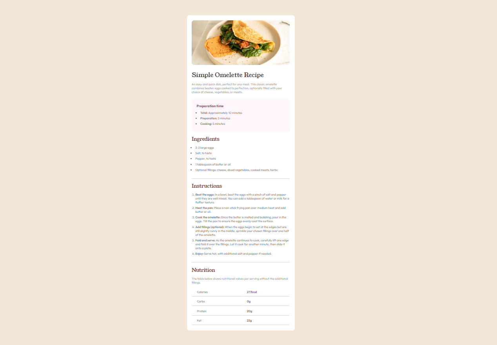

# Frontend Mentor - Blog preview card solution

This is a solution to the [Blog preview card challenge on Frontend Mentor](https://www.frontendmentor.io/challenges/blog-preview-card-ckPaj01IcS).

## Table of contents

- [Overview](#overview)
  - [The challenge](#the-challenge)
  - [Screenshot](#screenshot)
  - [Links](#links)
- [My process](#my-process)
  - [Built with](#built-with)
- [Author](#author)

## Overview

### The challenge

The challenge was to create a simple recipe website, considering all the appropriate HTML semantics and adding CSS styling.

### Screenshot

### Links

- Solution URL: https://www.frontendmentor.io/solutions/recipe-website-challenge-yVW2LscMCt
- Live Site URL: https://reciperainiero.netlify.app/

### Built with

- Semantic HTML5 markup
- CSS custom properties
- Flexbox

## Author

- Website - [Rainiero Herrada](https://www.linkedin.com/in/rainieroherrada/)
